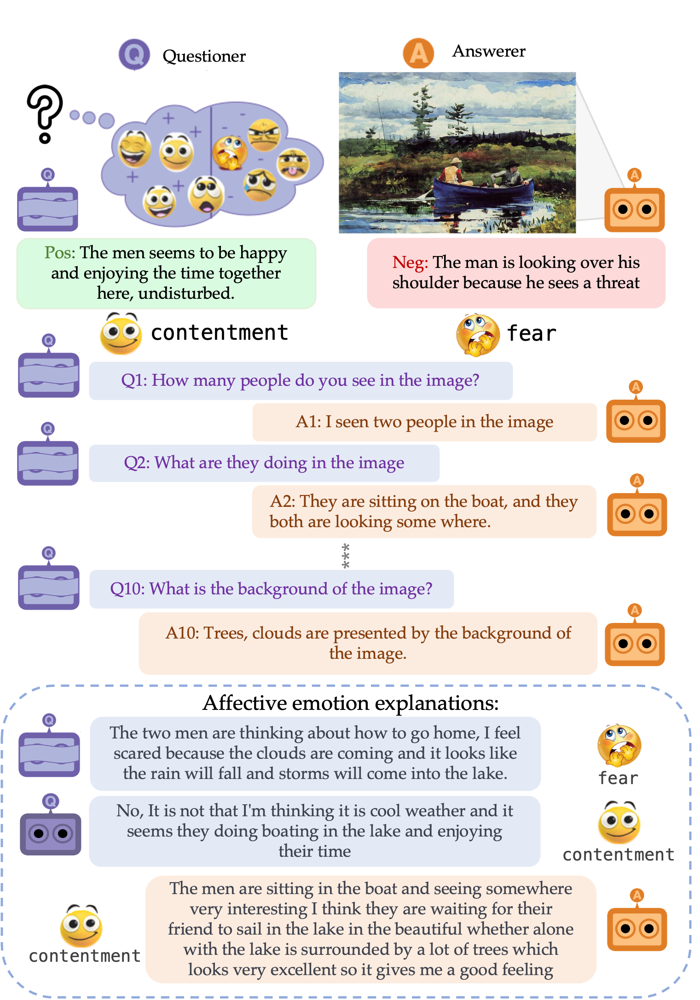

<div align="center">
<p align="center">
     
</p> 
<h1 align="center">
</h1>
<h1 align="center">
    Affective Visual Dialog: A Large-Scale Benchmark for Emotional Reasoning Based on Visually Grounded Conversations
</h1>

[](#)
[](#)
[](https://affective-visual-dialog.github.io/)

</div>

## 📰 News

- **30/08/2023**: The preprint of our paper is now available on [arXiv](https://arxiv.org/abs/2308.16349).

## Summary

- [📰 News](#-news)
- [Summary](#summary)
- [📚 Introduction](#-introduction)
- [📊 Baselines](#-baselines)
- [Citation](#citation)
- [References](#references)

<br>

## 📚 Introduction

 AffectVisDial is a large-scale dataset which consists of 50K 10-turn visually grounded dialogs as well as concluding emotion attributions and dialog-informed textual emotion explanations.

<br>

## 📊 Baselines

We provide baseline models explanation generation task:
  - [GenLM](./baselines/GenLM/): BERT- and BART-based models [3, 4]
  - [NLX-GPT](./models/2D/segmentation/): NLX-GPT based model [1]

<br>

## Citation

If you use our dataset, please cite the two following references:

```bibtex
@article{haydarov2023affective,
  title={Affective Visual Dialog: A Large-Scale Benchmark for Emotional Reasoning Based on Visually Grounded Conversations},
  author={Haydarov, Kilichbek and Shen, Xiaoqian and Madasu, Avinash and Salem, Mahmoud and Li, Li-Jia and Elsayed, Gamaleldin and Elhoseiny, Mohamed},
  journal={arXiv preprint arXiv:2308.16349},
  year={2023}
}
```
</br>

## References
1. _[Sammani et al., 2022] - NLX-GPT: A Model for Natural Language Explanations in Vision and Vision-Language Tasks
2. _[Li et al., 2022]_ - BLIP: Bootstrapping Language-Image Pre-training for Unified Vision-Language Understanding and Generation
3. _[Lewis et al., 2019]_ - BART: Denoising Sequence-to-Sequence Pre-training for Natural Language Generation, Translation, and Comprehension.
4. _[Dewlin et al., 2018]_ - BERT: Pre-training of Deep Bidirectional Transformers for Language Understanding